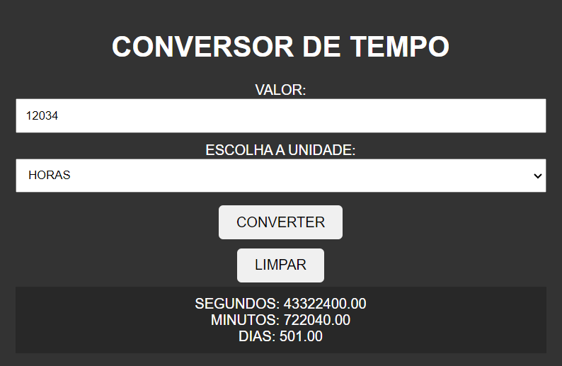

# CONVERSOR DE TEMPO
🆎CONVERSOR DE TEMPO EM HTML, CSS E JS.

  

## DESCRIÇÃO:
Este projeto é um conversor de tempo que permite aos usuários converter entre diferentes unidades de tempo, como segundos, minutos, horas, dias, meses e anos. Aqui estão as principais funcionalidades implementadas:

1. Inserir Valor e Selecionar Unidade:
   - Os usuários podem inserir o valor desejado no campo "VALOR" e selecionar a unidade de tempo de origem na lista suspensa "ESCOLHA A UNIDADE".

2. Converter:
   - Ao clicar no botão "CONVERTER", o sistema realizará a conversão para as outras unidades selecionadas e exibirá os resultados abaixo.

3. Limpar:
   - O botão "LIMPAR" permite que os usuários redefinam o formulário, limpando o valor inserido e os resultados exibidos.

## EXECUTANDO O PROJETO:
1. Inserir Valor e Escolher Unidade:
   - Digite o valor que deseja converter no campo "VALOR".
   - Escolha a unidade de tempo correspondente no menu suspenso "ESCOLHA A UNIDADE".

2. Converter:
   - Clique no botão "CONVERTER" para realizar a conversão do valor inserido.
   - O resultado da conversão será exibido abaixo do botão, mostrando os valores convertidos para as unidades de tempo selecionadas.

3. Limpar:
   - Se desejar limpar o campo de entrada e os resultados, clique no botão "LIMPAR".
   - Isso restaurará o campo de entrada para seu valor padrão e ocultará os resultados.
   
## NÃO SABE?
- Entendemos que para manipular arquivos em `HTML`, `CSS` e outras linguagens relacionadas, é necessário possuir conhecimento nessas áreas. Para auxiliar nesse aprendizado, oferecemos cursos gratuitos disponíveis:
* [CURSO DE HTML E CSS](https://github.com/VILHALVA/CURSO-DE-HTML-E-CSS)
* [CURSO DE JAVASCRIPT](https://github.com/VILHALVA/CURSO-DE-JAVASCRIPT)
* [CONFIRA MAIS CURSOS](https://github.com/VILHALVA?tab=repositories&q=+topic:CURSO)

## CREDITOS:
- [PROJETO CRIADO PELO VILHALVA](https://github.com/VILHALVA)
- [ESTÁ DISPONIVEL NO SITE](https://vilhalva.github.io/STYLER/STYLER.html)

